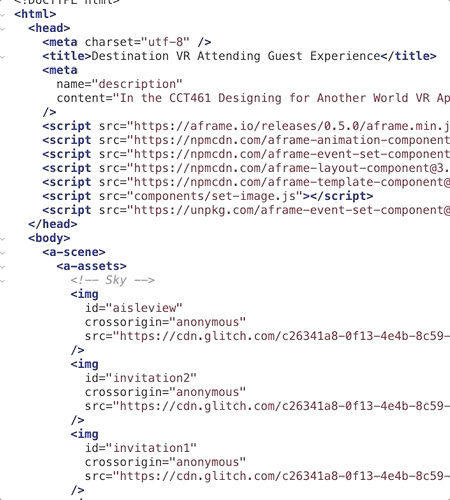

# Always Attend VR - Making the Experience the Possibility 


*The following repository contains the Designing for Another World: Virtual Reality App hosted through the third party platforms A-Frame and Glitch for the CCT461 Speculative Design course at the University of Toronto Mississauga.*

  

By: Alexandra Dumitras-Geli, Jennifer Palfi, Melanie Zaky, & Nicole Stafferie

---

## Overview 

- [Project Objective](#Project-Objective)
- [Installation Requirements](#Installation-Requirements)
- [File Contents](#File-Contents)

---

## Project Objective 

  

The purpose of this project is to explore the world of virtual reality and develop an applicable theme to current global circumstances. As the pandemic continues to evolve, many activities once taken for granted have become sought after experiences. 

Fortunatelty, the continuing advancements in the era of Digital Transformation allow societies to adapt to current situations and apply new methodologies to participate in common experiences. Through this lens, the design process of Always Attend VR was initiated. 


Always Attend VR is a virtual reality expeirence designed to proivde soon-to-be married couples and their guests the possibility to attend destination weddings from their own homes. Always Attend VR brings guests to the destination ceremony wherever it may take place. The virutal reality experience allows the guest to take part of the ceremony and enjoy their friends and loved-ones company whilst doing so. 

---

## Installation Requirements 

Always Attend VR is built with [A-Frame](https://aframe.io), a web framework for building virtual reality experiences.

The project was developed and hosted on the [Glitch Platform](https://glitch/com) to view the code development and VR experience simultaneously. 

The simplicity of the platforms do not require local installations. Both platforms require users to have a ```GitHub``` account to begin developing their own projects. 

A helpful link for users to become familiarized with the A-Frame platform can be found [here](https://aframe.io/docs/1.1.0/introduction/)

---

## Navigating the Repository 

## Glitch Project: Always Attend VR 



The repo contains the project files exported from ```Glitch```. The user has the option to import this repository from ```GitHub``` to their personal ```Glitch``` accounts to view the code and remix their own. 

## Design Reflection 


To fulfill the project deliverables, a ```Design Reflection``` was created to document the development process. This design document can be found [here](design_reflection.md)

## Demo Video


To meet the final assignment deliverable, the ```Always Attend VR Demo Video``` has been included in this repository. 

---

## File Contents

- [Design Reflection](design_reflection.md)
- [Images](Images)
- Always Attend VR Project Files - Imported from ```Glitch```
- CCT461 Always Attend VR Demo Video

---
