# Design Reflection: Always Attend VR - The VR Experience that Can Take You Anywhere

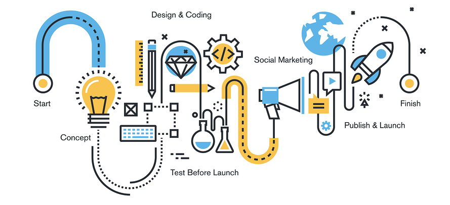

*The following respository contains the design reflection for the CCT461 Speculative Design course at the University of Toronto Mississauga.* 

By: Alexandra Dumitras-Geli, Jennifer Palfi, Melanie Zaky, & Nicole Stafferie

---

## Design Objective: Why Always Attend VR? 

Always Attend VR is an interactive virtual reality experience that allows users to attend weddings from virtually anywhere in the world. The new times we are living in have required everyone to become more creative in staying connected with loved ones.

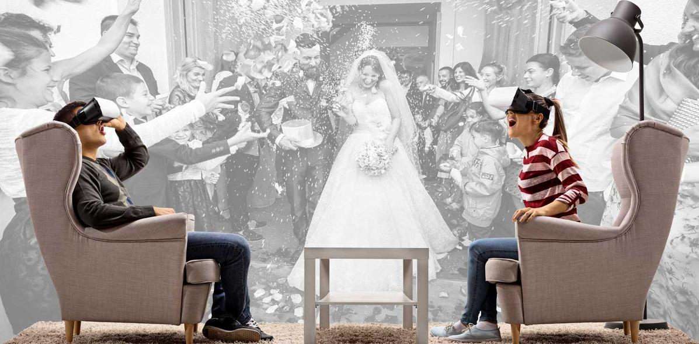


One of the major events that have been cancelled due to COVID-19 restrictions have been weddings. Weddings are a significant milestone that shouldn’t require people to cut back on attendees who they’d want to share this special day with. With Always Attend VR we wanted to bring this special day to all the attendees in the comfort and safety of their homes. Always Attend VR allows users to be immersed in the wedding experience- from the ceremony to the reception as if they were attending in person. All of this with the power of virtual reality. With this application, the barriers or travel, illness, etc. will be mitigated and allow anyone to attend a wedding anywhere in the world. 

---

## Document Overview 

[Background](#Background)

- [The Problem](#The-Problem)
- [Research](#Research) 
- [Direction](#Direction) 

[Prototyping and Validation](#Prototyping-and-Validation) 

- [Development Process](#Development-Process)
- [Troubleshooting](#Troubleshooting) 

[Postmortem](#Postmortem) 

- [Evaluation](#Evaluation) 
- [Conclusion](#Conclusion) 
- [Future Directions](#Future-Directions) 

---

## Background 

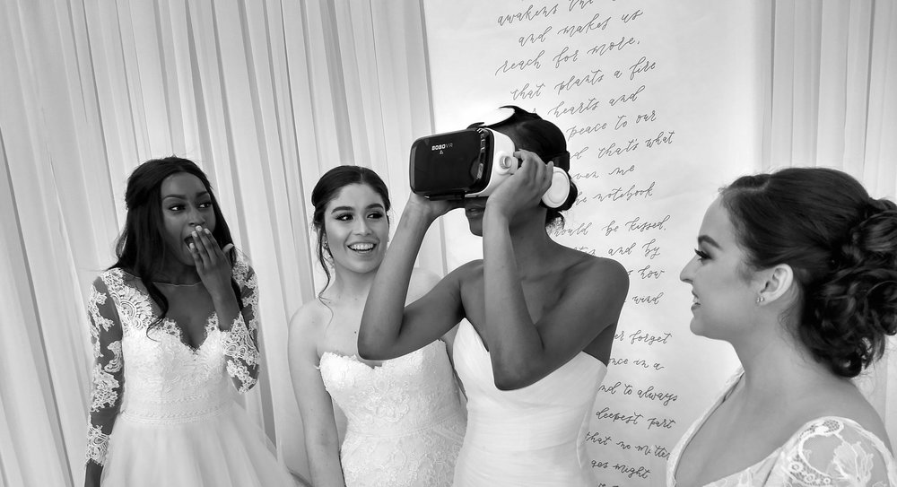

## The Problem 

We are living in a global pandemic, several travel and gathering restrictions are currently in place. Prices for travelling and vacation are only increasing and most people can’t afford or are unable to take off work to travel in the first place. More generally, some people are unable to attend events due to illness, age, or other commitments. Does this mean people should miss milestone events such as weddings? With advanced technology becoming more readily accessible.

    How might we build a virtual reality system ensuring people can always attend weddings?

## Research 

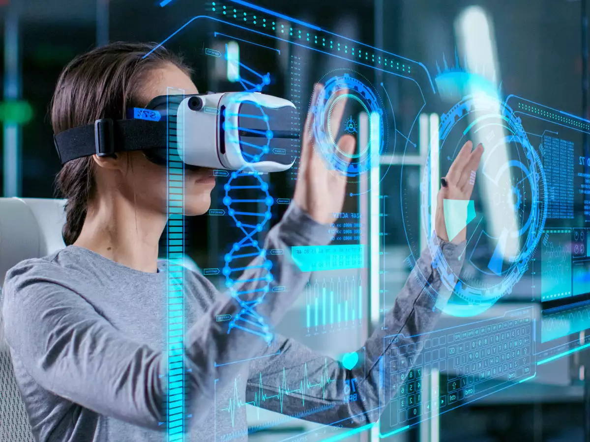

The concept of virtual ceremonies is something that has been considered by some scholars and even performed on a basic level throughout 2020. A research report by Christopher Johnson covers the idea of using virtual reality in religious studies in the classroom environment (2018). It was found that by using this method of learning and technology helped create an empathetic understanding of the event taking place, allowing a virtually immersive experience (Johnson, 2018). Creating an empathetic understanding is a vital aspect of the virtual reality system as it ensures a certain emotion is evoked from the user, making the experience more immersive. 

This was an interesting find as it shows the possibilities of allowing virtual reality technology in affiliation with religious ceremonies for the benefit of the guests. The paper also highlights how cost effective this solution was for people to still enjoy the experience (Johnson, 2018). A rather different example of the virtual reality medium is showcased in an article by Kristopher Tapley (2017). This reading covered the academy award winner, Alejandro G.Inarritu, in his achievements for producing a virtual reality simulation in a Los Angeles art museum in the ways it evoked emotional responses and gave people a first person experience of a complex scenerio (Tapley, 2017). A key point to highlight from this reading was the method of which made the system feel so immersive for the user. Alejandro used details such as including other people in the view and the ability to walk around and see different perspectives (Tapley, 2017). 

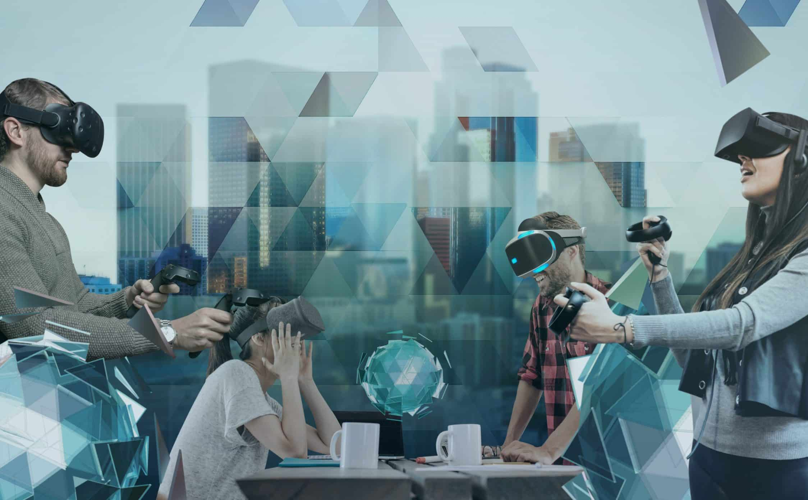

Furthermore, the article explains that due to the success of this simulation, it is worth considering what other contexts it could be used for, such as awards ceremonies (Tapley, 2017). There is also extensive research and produced systems surrounding the idea of using virtual reality for methods of tourism. Technology has evolved from a focus of sharing moments to progressing into sharing experiences (Yung & Khoo-Lattimore, 2019). In order to effectively make this possible and develop virtual realities, it must have different visualizations (ability for movements), it needs to ensure their is a sense of belief to the experience creating a sense of immersion and lastly, interactivity provided a degree of control in the experience (Yung & Khoo-Lattimore, 2019). Thus, based on our research, we identified a particular gap in the virtual reality system, as well as based on current world trends such as the COVID-19 pandemic; there is a need for an immersive system enabling people to attend ceremonies. 

## Direction

Always Attend VR hopes to use virtual reality technologies to ensure that all guests can attend their family or friends’ weddings no matter the circumstance. 

**We agreed that our virtual reality would:**

- Incorporate different angles (seats at the ceremony) in a first person perspective
- Use visuals to create an immersive experience 
- Give users control over what perspective they wanted to experience the wedding
- Create a seamless, simple user-friendly experience 

---

## Prototyping and Validation 

## Development Process 

**Getting Started** 

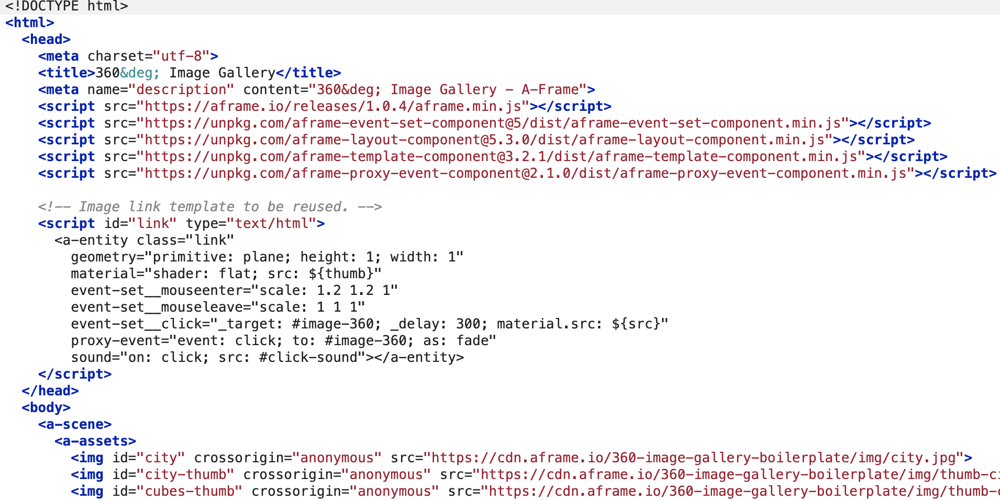 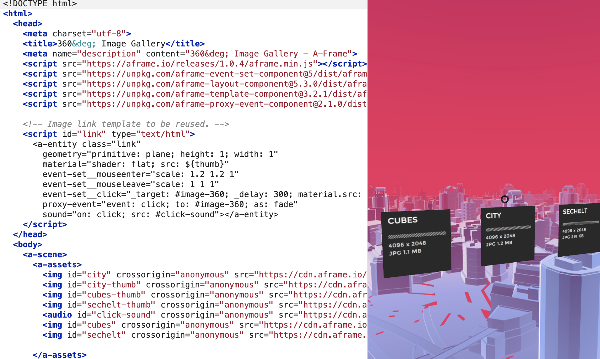 

The first part of the prototyping process was building off of the 360 degree image gallery- provided by A-frame. Inorder to deploy the VR experience we had to remix the Aframe platform with the glitch platform.

**Remixing Our Code**

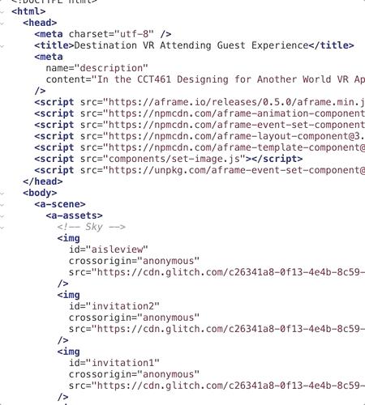

First thing we did here was use the community components. These are essentially prewritten published snippets of code that import templates, environments etc. It’s prewritten code- libraries that you can import in your code, developed by developers who provide access to them. We selected which ones we needed from the A frame starter code, selecting four components. 

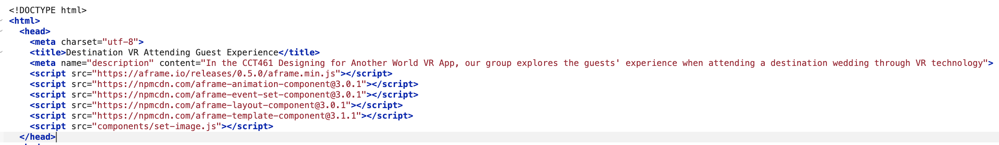

The first was the latest release of A frame- which we downloaded to make sure that all the files are updated. The other 3 components we used were templates, layouts, and then the event set component. What is important about importing these prepublished code is that you can use community based support and you don’t need to write out 100s of lines of code yourself. 

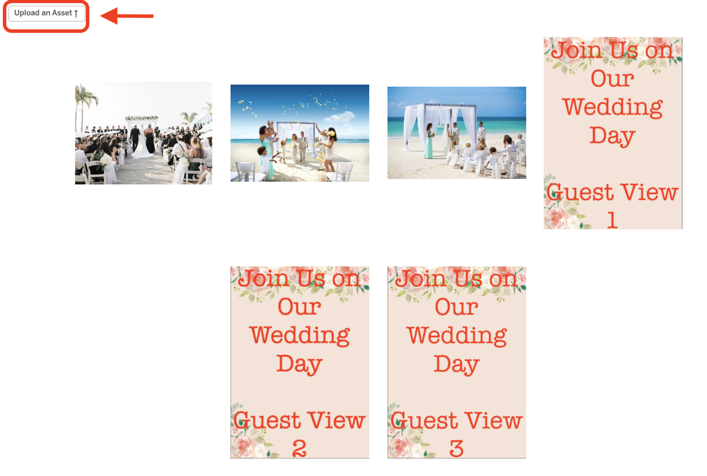 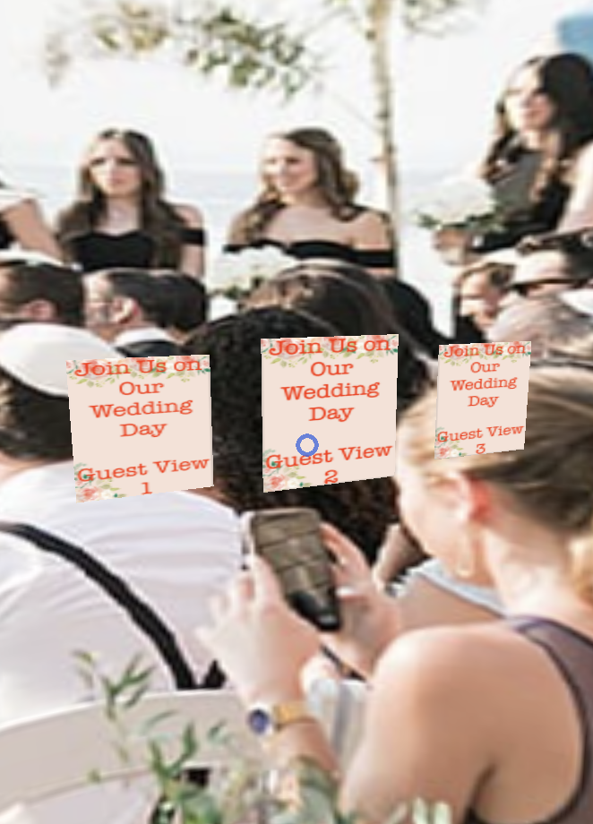 

After this we next found images that suited our VR experience. This proved to be difficult because A-frame’s graphic components are specific- following an XYZ axis while most photos are 2D so it was hard to manipulate into a 3D image. This was tested through trial and error. I stored the images on glitche’s asset management system which is great because if we need to continue setting a file path it would be difficult for another user to replicate this on their own glitch platform. This platform is much better in comparison to working on a jupiter notebook. Next after building off starter code for the 360 image gallery we called our ‘variables’ or my assets in glitch and created an ID for each image (total of 6 images). After that the rest of the prototyping and validation went as follows: 


1. Create an ID for the 3 experiences. We wanted to be able to import the images. Here we used the source equals variable to do this. We also added an audio file- found audio file of church bells to go with the theme- again labeled it and used the source equals variable to ‘call it’ 

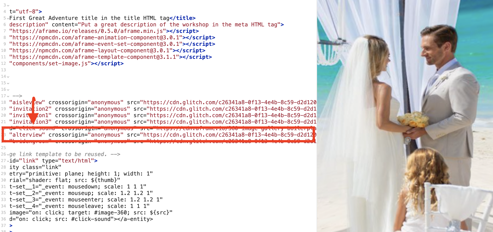 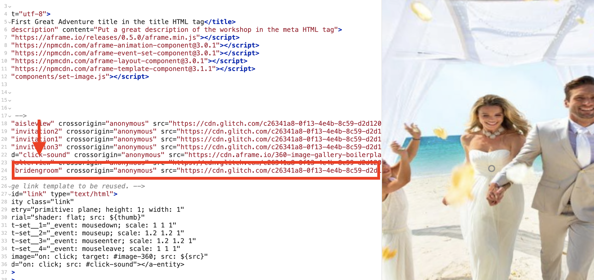 

2. Set up the event setter component which would call on a visual feedback- how i turned a 2D frame into a 3D frame. It modifies a flat image- this is in A frame 

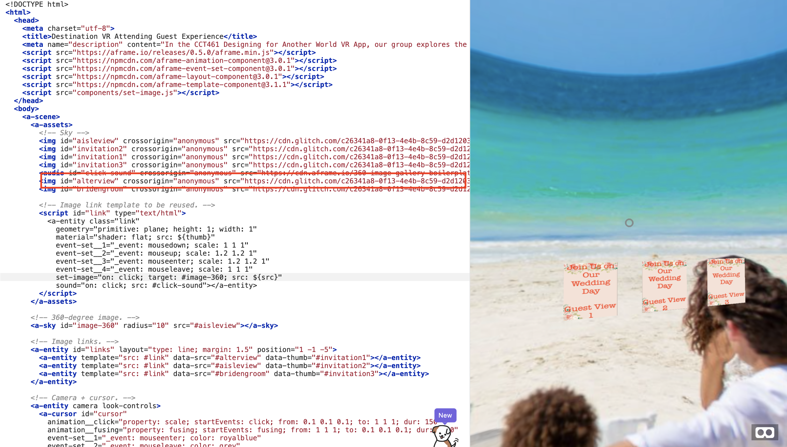

3. Link tiles to experiences- set up an entity- 3 criterias: 

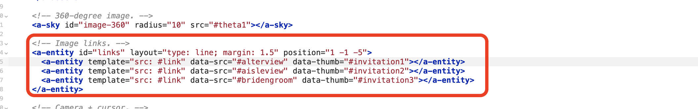 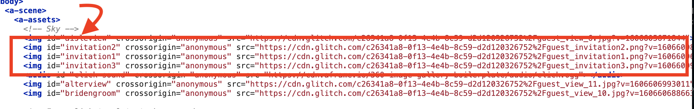 

- Link created on template variable which then creates a link 
- data source 

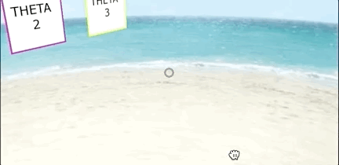 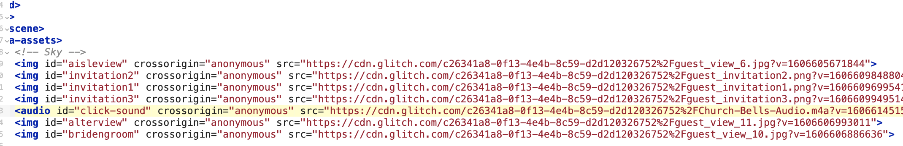 

- implement the camera in cursor code- part of the community code as well  

## Troubleshooting 

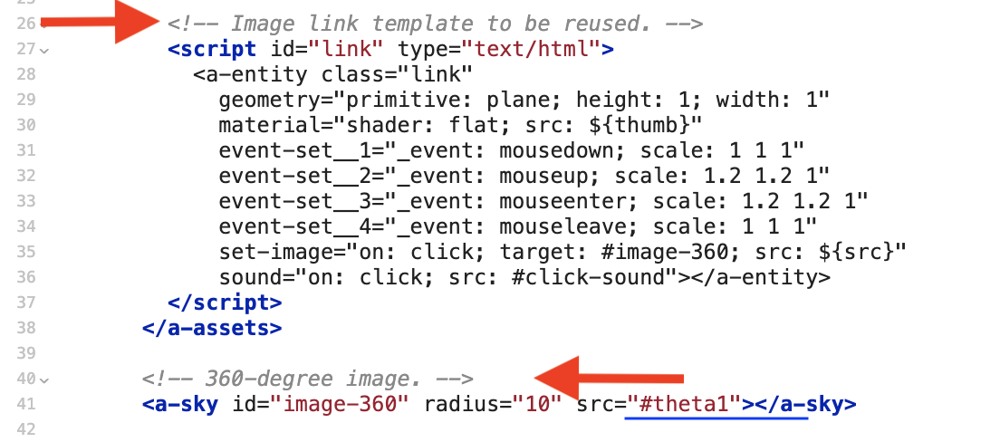 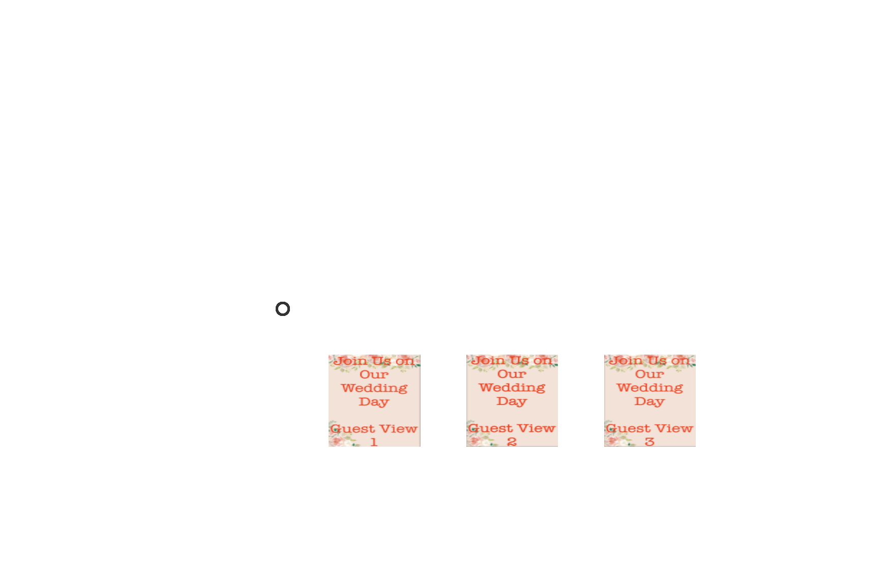 

One error we ran into was connecting image experiences to tiles. Getting this to work was trial and error. At first it did not connect properly. When we deployed the VR viewer you were not able to view the first experience, only the second and third one. 

The process we underwent to resolve this error was refining our code development process. Unfortunately, due to the unfamiliarity with the language, we adopted the ```line-by-line``` approach. Going through each variable and esnuring the proper links were identified and definitions were set accoridngly. Although this is a lengthy process, our group managed to identify the gap in the code development. Which can be viewed below. 

 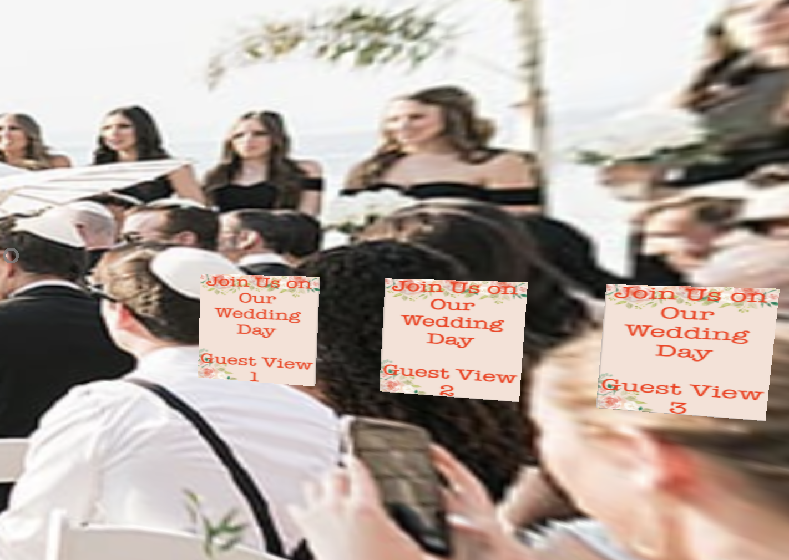 

--- 

## Postmortem 

## Evaluation 

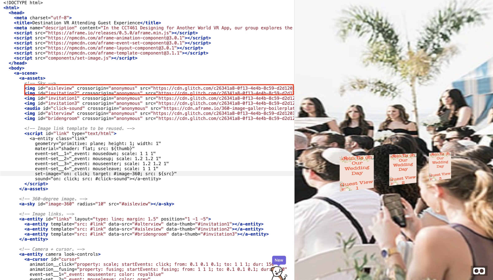  

When brainstorming ideas of what type of VR system we should create, we knew it would be most effective to create one that supports the current real life events in which we are encountering. Due to COVID19, normal life hasn’t been so normal. Traditional events, such as weddings and birthdays are no longer as easy as just getting an invitation to attend. They come with many more obstacles, including, but not limited to; limitations to how many people can attend, travel restrictions, and the simple fact of being fearful of contracting the virus from being in close proximity to others. 

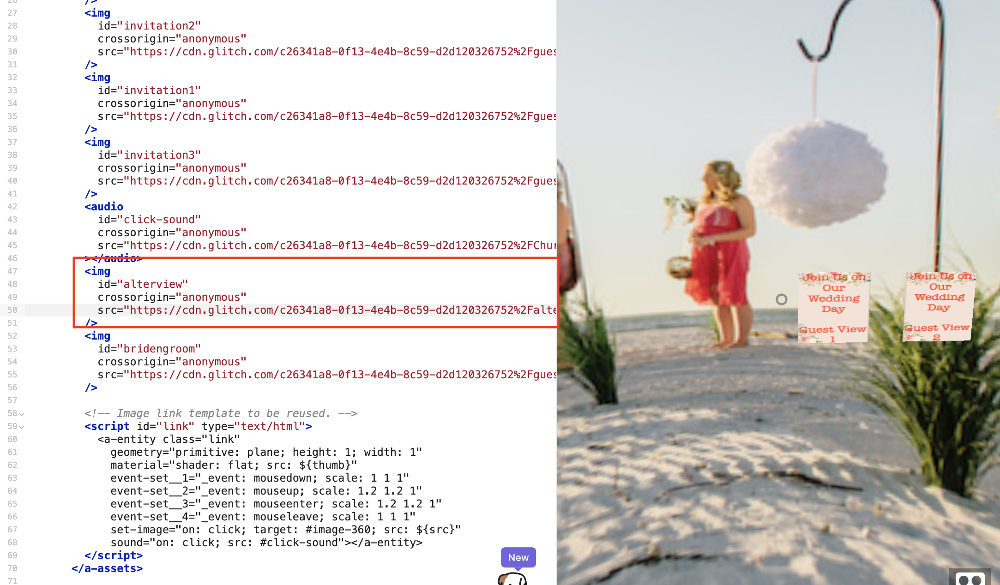  

Therefore, we developed the VR system “Always Attend VR”, which allows users to attend any wedding remotely. Unlike the traditional wedding videography/film, the VR system allows users to view 360 degrees of certain scenes within the wedding. The VR system specifically provides three different viewpoints from a guests perspective, including the bride and her father walking down the aisle, the bride and groom coming back down the aisle and then one of the ceremony. Essentially, due to the A-frame platform and link tiles, the user is capable of looking through and controlling the selected scenes of their choice. 

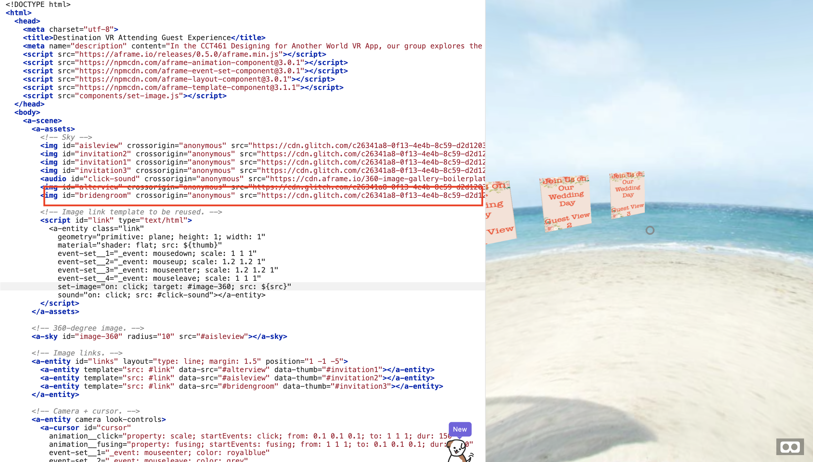  

While the VR system we have created operates efficiently, it has the potential to expand in functionality. For instance, through greater coding, the viewer would have the potential to view a broader range of scenes than just the ones they are currently limited to. In addition, this VR system also has the potential to be developed on a platform which allows users to view weddings on a VR headset, rather than just a computer screen. This would add onto the VR experience and help the viewer feel like they are truly part of the wedding experience. 

## Conclusion 


To conclude, the VR system in which we have developed makes it possible for users to attend their loved ones’ weddings regardless of the circumstances. Financial constraints, pandemics, travel restrictions, and minimal work flexibility can no longer prohibit one from attending a wedding, regardless of its location. Despite watching it remotely, Always Attend VR provides the user with the feeling of actually being there with the help of the 360 degree view and link tiles. 


In addition, this VR system was made possible through the use of the AFrame platform, along with the glitch platform. A-Frame was used to build off of the 360 degree image gallery provided by the platform, while the glitch platform made the application a smoother experience for the user. In addition, HTML was conducted. Essentially, the combination of these platforms and coding method developed an MVP (minimum viable product), which resulted in a successful prototype. Ultimately, Always Attend VR encompasses all the primary elements of what our VR design aims to achieve and is simplistic in use, while providing users with an “in person” like experience. 

## Future Directions 

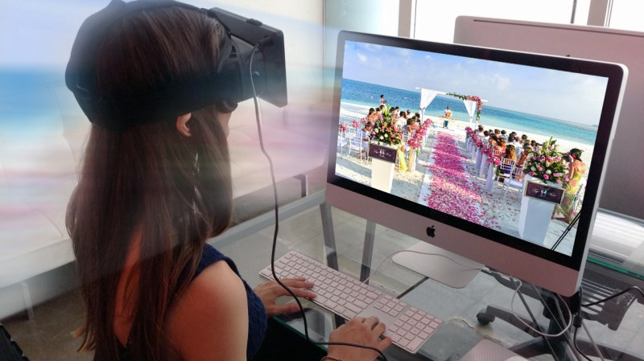

Always Attend VR hopes to become a universally used software that will be available on multiple platforms allowing virtually anyone to have access. Our goal with this application is to make it as accessible to as many people as we can. We understand how disheartening it can be to not be able to attend such a milestone event because of potential health regulations, finances, or travel restrictions. We want to make sure that everyone is able to attend and be a part of this event regardless of location. 

---

## References 

References documentation can be found in [here](CCT461_References.docx). To review the document select the here option, then view raw. The references document will be downloaded to the users local drive.


